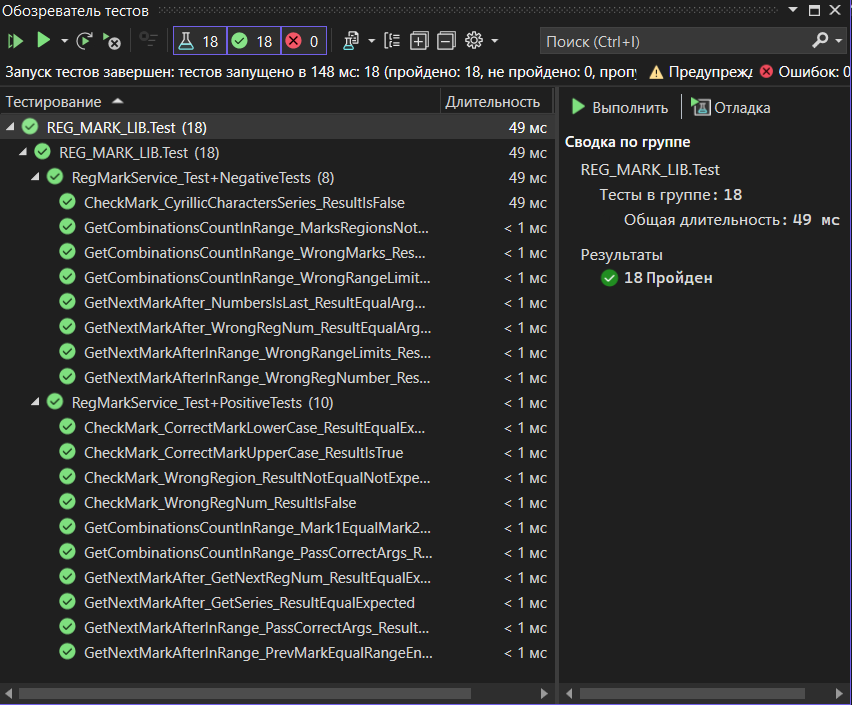

# REG_MARK_LIB
Библиотека работы с регистрационными знаками и проект модульных тестов

## Начало работы

Эти инструкции предоставят вам копию проекта и помогут запустить на вашем локальном компьютере для разработки и тестирования.

### Необходимые условия

Что нужно для установки программного обеспечения и как его установить
1. Git
2. Visual Studio 2022
3. dot net 8

### Установка

Пошаговая серия примеров, которые говорят, что вы должны запустить
1. Откройте Git Bash и введите git clone https://github.com/anschek/EP01/tree/first-session2
3. Откройте решение с помощью Visual Studio
4. Нажмите Тест/Запуск тестов

После запуска тестов вы увидите следующее

## Авторы

**A.N. Schekaleva** - *Initial work* - [anschek](https://github.com/anschek)